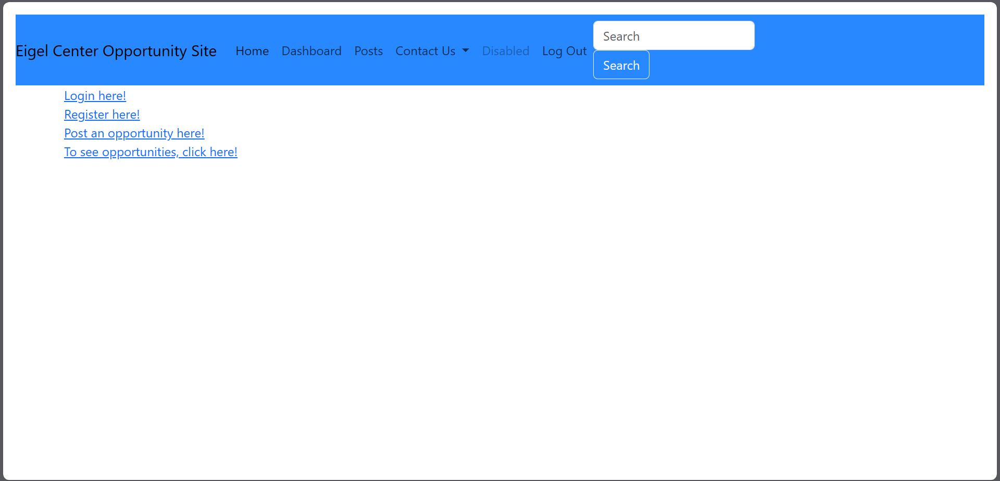
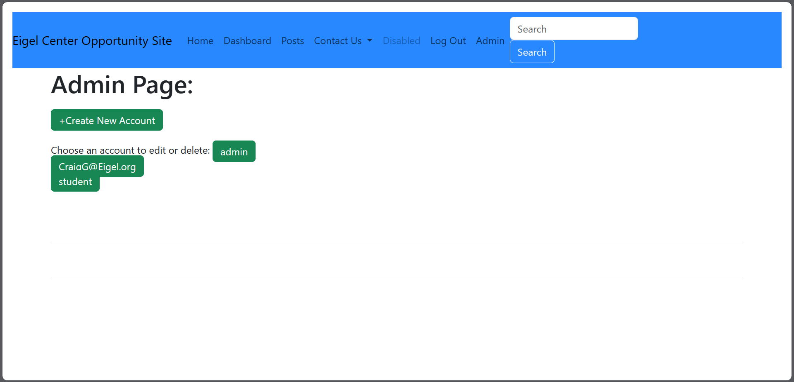
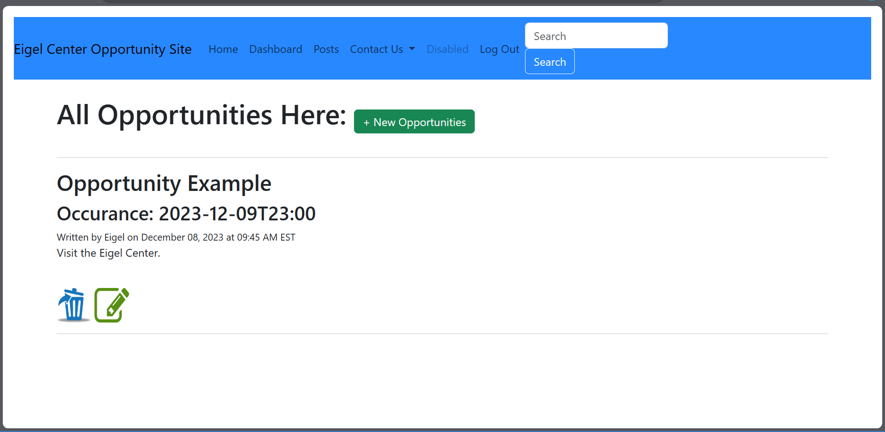
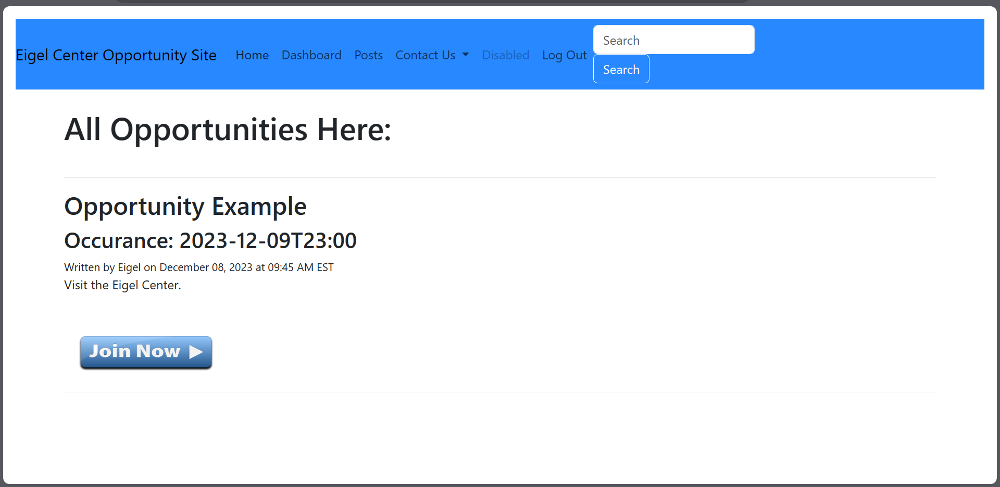

# Documentation for our Website
Welcome to our website repository!
Our group, C-Suite, of CS261 2023, created this website for the Eigel Center of Xavier University as an example of a possible volunteer opportunity website where comunity partners could create, edit, and delete opportunities, and where students could sign up for them.

Below is where you'll be given information on how to pull, use, and if desired, edit our code, along with future endeavors as well as any and all dependencies.
## Main Contributors:
The main contributors to this project are:

[Quentin Barber](https://github.com/QBarbs)

[Alex Welch](https://github.com/TheArtifice305)

[Alex Kelley](https://github.com/alex-xgk)

[A.J. Frazier](https://github.com/AJFraz14)

## How to Activate Project:
1. First, you clone the repository either through GitHub using the http webpage or using an SSH key.
- [SSH Key Information](https://docs.github.com/en/authentication/connecting-to-github-with-ssh)
- [HTTP Information](https://github.com/git-guides/git-clone)
2. Next activate a virtual machine inside the IDE of your choice. For our choice, we primarily used Visual Studio Code.
- For Windows: ```ctrl + shift + P```
- For Mac: ```cmd + shift + P```
3. Next, you'll need to download a few dependencies for this to work. You can use these pip commands:
- ```pip install Flask```
- ```pip install Flask-SQLAlchemy```
- ```pip install pytz```
4. In order to run the application, you can use:
    ```
    flask --app mainpackage run --debug
    ```
    and this will give you the project in its entirety while also giving you the ability to test out any code you yourself decide to implement.
## Walkthrough:
Here, we will give you a rundown on some important aspects of the website users and/or developers may want to know more about.

-  Above is a picture of the main/introduction     screen that should appear on your computer as soon as you run the application. There are links that will take you to certain webpages already there. For example: 
   - Login here will take you to the login page for if you have already registered an account.
   - Register here will take you to the register page to register for an account.
   - Post an opportunity here will be available only if you've logged in with an admin/community partner account.
   - To see opportunities will allow anyone to see an opportunity, however, only student accounts can join them.

- In order to create an opportunity, you need to be either a community partner or an admin. Admins have a special role in which they are able to create community partners and new opportunities, and those community partners can use their accounts to create opportunities.
    - **You can use the login we have provided for easy admin access.**
    - **Email: admin**
    - **Password: admin**
- The admin screen should look like this when you click on the *admin* tab that should appear beside the search bar once you've logged in.

- This is where you'll be able to create and manage accounts, whether for students, community partners, or for other admins.
- Clicking on *+Create New Account* will let you create a new account, obviously, while clicking on the accounts below will allow you to edit or delete the accounts.
- Community partners are able to only create opportunities.
- If you're logged into a community partner or admin account, the *post opportunities* screen should look like this:

- If you click on *+ New Opportunities*, you'll be able to create a new opportunity for students to sign up for. You'll make a title, add whoever is overseeing the opportunity, a date and time, and a description of what students will be doing. After, you'll be given two icons, a pencil and a trashcan. These will allow to to edit and delete the opportunity respectively.
- If you're logged into a student account, then post the admin as well as post opportunity functions and features will not be available to you. Instead, you'll be given the sign up feature will, when clicked, will register you for the opportunity. Student accounts can also cancel their attendance for their own registered opportunities by clicking "Deregister" on the respective opportunity that they wish to no longer attend to.  


- Most of the webpages (e.g. admin page, create new opportunity page, etc.), will require the user to be logged in, or else they will be redirected to the login page.
- Certain pages will also only allow access to accounts with certain roles, along with requiring the user to be both logged (e.g. to access the webpage that creates a new opportunity, the user's role must either be the community partner or admin role). Otherwise, the user will be redirected to the login page.

Those are all the main important aspects of the project itself. Feel free to reach out to the developers for information if needed/wanted. We hope that this gives you an idea of the project and the necessary steps to improve upon it if so wished. Thank you.